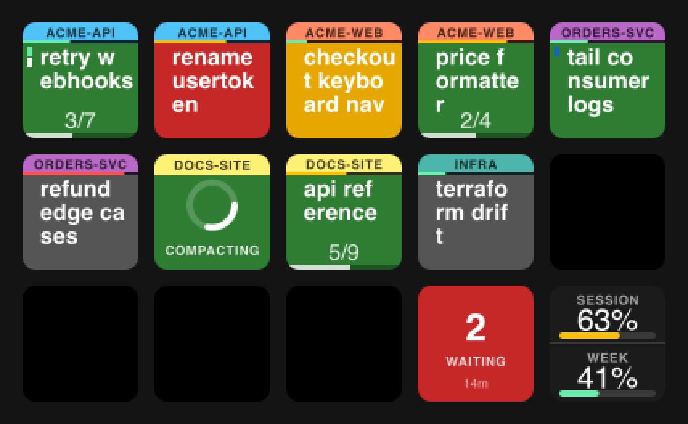
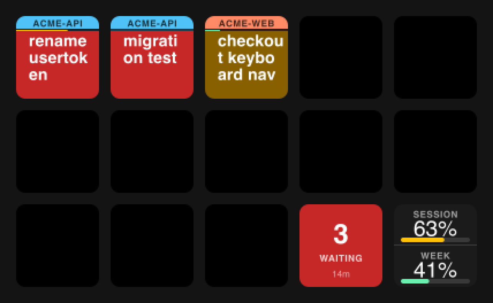
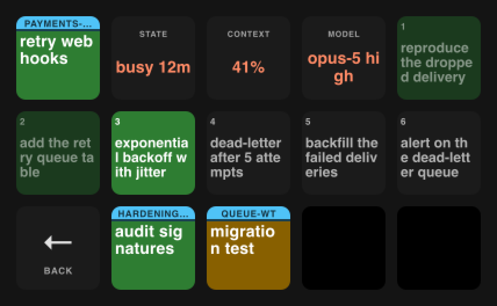
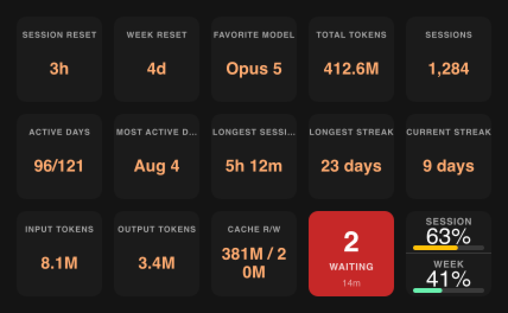
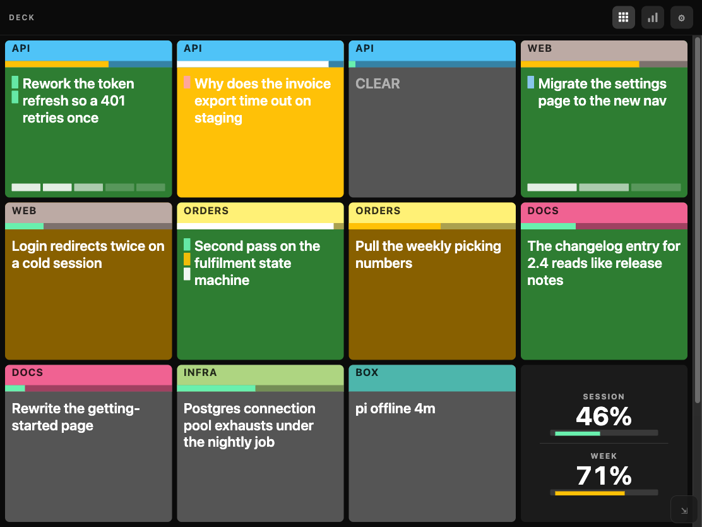
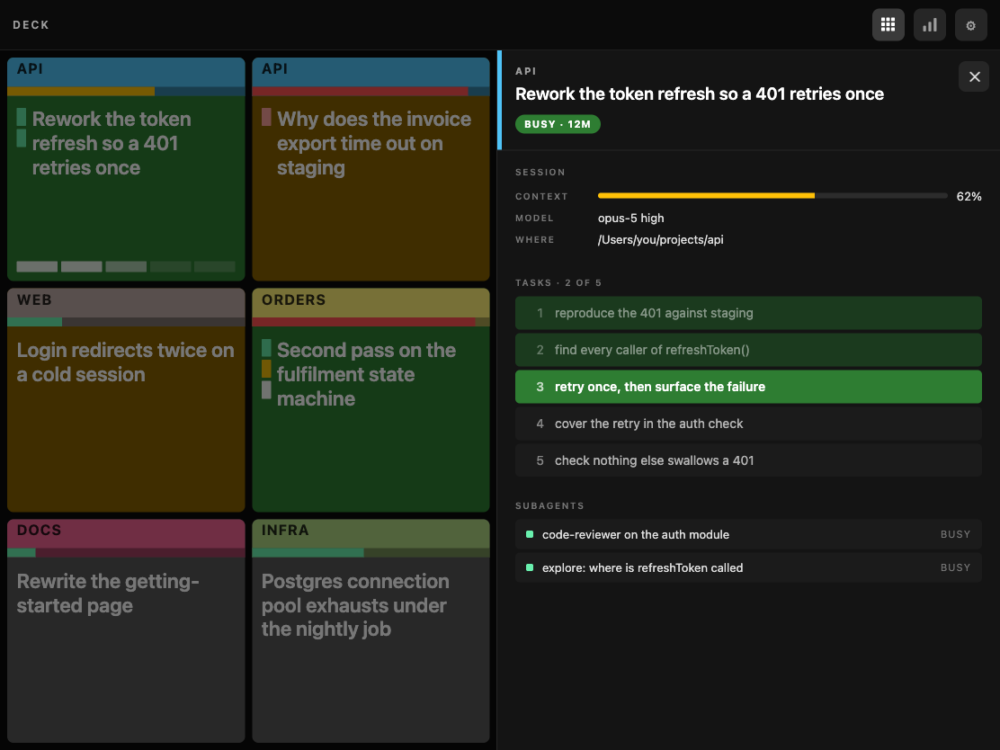
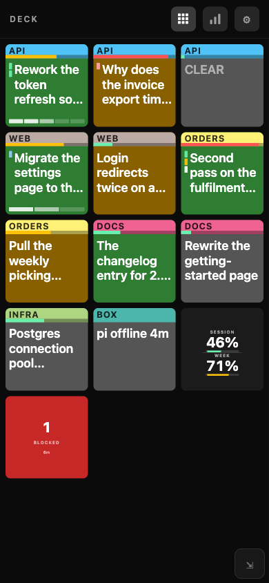

# Claude Deck

Your running Claude Code sessions, on a Stream Deck MK.2. One key per session,
coloured by what that session is doing right now; press a key to jump to its
VS Code window.

The same board is also a web page on your LAN — scan the QR `npm start` prints
and it's on your phone or iPad, with a layout you can set and no fifteen-key
limit. See [the same board, on a phone or an iPad](#the-same-board-on-a-phone-or-an-ipad).



Every key is one live session: the project name in caps along the top in that
project's colour, the session's own title under it, a `done/total` counter when
it's working through a task list, and a thin gauge along the bottom for how full
its context window is (green, amber past 50%, red past 85%, and once it's red
it flashes red/white about once a second). Press a key to focus that
window.

| Colour | Status | Meaning |
|---|---|---|
| green | `busy` | actively working |
| red | `requires_action` | blocked on you — this key pulses |
| amber | `waiting` | waiting on input |
| green + blue dot | `shell` | turn's over, but a shell it started in the background is still running |
| gray | `idle` | idle |

The bottom-right two keys leave the rotation, so 13 are session keys:

- **Usage** (bottom-right) — how much of your session and weekly rate limits is
  spent. Press it for the stats board.
- **Status** (next to it) — one key answering whichever question is live. When
  anything is blocked on you it goes red with the count and how long the worst
  one has waited, and pressing it opens that queue, worst first.

  When nothing is, it rests on how many sessions are running — `14 SESSIONS` —
  and a press starts a short cycle through the two halves of that number:
  first the working ones (`9 WORKING`, longest-busy first), then the idle ones
  (`5 INACTIVE`, longest-idle first), then back. **The key always names the
  board you're looking at**, so the count under your finger is the one on the
  screen.

  On the working board, a session that finishes doesn't just vanish — it goes
  grey and its key drains a bar over five seconds before dropping off, so you
  see it leave instead of wondering whether it was ever there.

  Blocked and the rest share a key because they're never both the answer:
  "10 inactive" isn't what you want to read while two sessions are waiting on you,
  and once nothing is blocked the blocked count is a zero that doesn't need a
  key.

Run more than 13 sessions and the extras get no key — but nothing you can act
on disappears with them. Both queues are built from every session, not just the
ones on the board, so a session that's blocked or inactive still reaches the status
key. What a full board loses is the glance, not the reach.

Each project gets a colour bar naming it, and keeps that colour — across the
session and across restarts. It's remembered in
`~/.claude/streamdeck-accents.json`; delete that file and every project is
simply assigned a fresh colour the next time it's seen.

To choose the colours yourself, press the usage key for the stats board, then
the **⚙ CONFIG** key next to the back arrow. A page opens in your browser
listing every open project; pick one of the eight accents and the deck updates
within two seconds. If another open project already wears it, the two swap —
so no two projects on the board are ever the same colour. The page is served
by the daemon on localhost, only while it's running, and only reachable with
the token in the URL it just opened.

The page's **Activity** tab is everything a 72px key can't carry:

- **Output tokens**, one column per bucket, stacked by whose meter ran — and
  the same total split by model. The ship-review skill runs `codex exec` for a
  second opinion, so that work shows beside Claude's rather than going
  uncounted; the columns only stack (and the legend only appears) if more than
  one vendor actually ran in the window.
- **What the metered reviews cost.** That skill falls back from the ChatGPT
  subscription to the paid OpenAI API, and those runs are the only ones on the
  machine that cost money per run. The dollar figure comes from the skill's own
  ledger (`~/.kobeco/ship-reviews.jsonl`, the same file the `review-usage`
  skill reads), so the two always agree. A window with no paid review says
  nothing rather than `$0.00` — the other rungs are prepaid, not free.
- **Sessions in parallel**, the peak per bucket, coloured by what they were doing.
  Open is not the same as working, and this is the difference. An hour the
  daemon wasn't running is drawn striped rather than empty — a sleeping
  machine and an idle one both produce silence, and they must not look alike.

Pick the window at the top — **12** or **24 hours** (hourly), **7 days**
(6-hourly), **30 days** (daily), **3** or **6 months** (every 2 or 4 days),
**1 year** or **all time** (weekly) — and everything on the page follows it.
Hover any column for its bucket and its number.
- **Where the time went**: time each project spent working, waiting, and
  blocked on you over the same window, with a pie beside it showing each
  project's share. Slices wear the colour the project wears on the deck, so
  the table and the pie read as one thing. Idle time isn't counted — a session
  sitting open isn't time that went anywhere.

## Moving sessions to another machine

Claude Code deletes its own transcripts after 30 days, and they only ever
resume on the machine that made them. Two commands carry one — with its **full
history** — somewhere else:

```bash
npm run sessions:save                 # every live local session
npm run sessions:save -- kob-trace    # or just the projects you name
```

That writes `~/.claude-deck-sessions/<date>-<time>.tgz` (owner-only): each
session's whole transcript, the subagent transcripts it spawned, and the
project's memory notes. A recent bundle here was 4.9 MB of history in a 1.4 MB
archive.

Copy it over, then on the other machine:

```bash
npm run sessions:restore                          # list what's available
npm run sessions:restore -- <bundle>.tgz          # show exactly what it would do
npm run sessions:restore -- <bundle>.tgz --write  # do it
```

Both are in VS Code's command palette too — **Claude Stream Deck: Save Claude
sessions for another machine**, and **… Restore Claude sessions from another
machine…**, which lists the bundles you have and shows the plan for the one you
pick. The palette never writes: it opens a terminal with the command, and you
add `--write`.

It never writes without `--write`, and it prints where every session would
land first. If the other machine keeps a project somewhere else, say so:
`--to=/Users/you/projects/app=/home/you/code/app`.

Each restored session gets a **new id**, because the machine you copied from
usually still has the original and two machines writing one history under one
id ends badly. What you get is a copy that resumes, not the same session in two
places. Undo/file-history doesn't survive the move — it points at scratch
directories the other machine hasn't got — and existing memory notes are never
overwritten. The conversation itself comes across whole.

The state history is `~/.claude/streamdeck-history.jsonl`, kept 30 days; the
token totals are `~/.claude/streamdeck-tokens.jsonl`, kept a year, read from
Claude Code's transcripts, the Codex CLI's session logs, and the ship-review
ledger. That second
file exists because both tools delete their own history — Claude Code after 30
days (`cleanupPeriodDays`) — so the numbers have to be copied out while
they're there. Both are read-only history — delete either and the charts start again
from empty. Today's total blocked time also gets a tile on the stats board.

The same page reorders the board. Drag a project by its **⠿** handle and drop
it where you want; a line shows where it will land. Topmost is the first block
on the deck — top-left key — and a project's sessions always stay together in
one block, so you're only ever ordering projects. Anything you haven't dragged
keeps arriving in the order it first appeared, and the order survives restarts
alongside the colours.

The daemon is read-only about your sessions: it polls the files Claude Code
already writes under `~/.claude/` every two seconds and redraws what changed.
No hooks, no config file, nothing written back except its own notes to itself
(colours and order, the state and token history above, and the board's address)
and to the VS Code extension.

The one thing it does beyond reading and drawing is listen: the board page below
is served from this machine on your LAN. `STREAMDECK_NO_BOARD=1` turns that off.

## The other three boards

**Attention** — press the attention key for just the sessions that want you,
worst first. It re-sorts while it's up, and when the last one clears you're
dropped back to the normal board.



**Detail** — press a session's key, then press it again, and that one session
takes over all 15 keys: its title across two keys, then state, context (a ring,
in the same green/amber/red as the gauge) and
model, then its task list (done dimmed, in-progress bright), and pinned to the
end, the subagents it has running. `BACK` returns. What counts as "again"
depends on the extension — see Known limits.



**Stats** — the usage key's second press. With
[claude-swap](https://github.com/realiti4/claude-swap) installed, every
subscription it manages gets two keys, active account first with a green border:
session / week usage, and the time until each resets. Then this machine's
memory pressure and swap use (press it to read them in GB instead of %), the
same for every reachable Remote-SSH host, and the daemon's version. `BACK` returns, as does
the usage key. All-time totals live on the activity page.



> The screenshots are rendered by `npm run board-shot`, which draws made-up
> sessions through the same code the daemon draws with.

## The same board, on a phone or an iPad

`npm start` prints a URL and a QR code. Point a camera at it and the whole
board is a web page on your LAN — same sessions, same colours, same 2s beat as
the deck. A compacting session spins the same ring it does on a key.

No Stream Deck plugged in? `npm start` still runs: it says so on its first
line, prints the URL and QR, and serves this page with nothing else to draw on.

```
board: http://192.168.2.28:8765/board?t=40968304-…
█ ▄▄▄▄▄ █▀ █▀▀█▀▀▄▀▀▄▀█▀▄▀█ ▄▄▄▄▄ █
█ █   █ █▀ ▄ █▀▄ ▄▀▀▀▄▄ ▄ █ █   █ █
…
```



**The address stays put across restarts** — port 8765, and the token is
remembered beside it — so a page left open reconnects on its own and a
bookmark or a home-screen icon keeps working. If something else holds the port
the board comes up on a spare one and says so above the QR; `STREAMDECK_PORT`
picks a different one.

### What it does that fifteen keys can't

- **No slot limit.** Every session gets a tile and the page scrolls, so nothing
  falls off the end. The two reserved keys — usage and status — trail the
  sessions.
- **The layout is yours.** Columns, rows and text size from the gear, or drag
  the grip in the bottom corner (left/right for columns, up/down for rows).
  Everything inside a key scales with one number, so a key stays proportional
  instead of just growing its body text. The choice lives in that browser, so
  a phone and an iPad each keep their own.
- **Tap a key** to raise that session's VS Code window, exactly as a first
  press on the deck does.
- **Tap it again** for the whole session at length: state, context, model,
  where it's running, its *entire* task list, and every subagent it has going.
  The deck's detail board has to window that list to what twelve buttons hold;
  a page that scrolls doesn't.



### On a phone



A key is never taller than square, however the rows and columns divide the
screen — five columns of a 390px phone against a third of its height would
otherwise be a key three times taller than it is wide. A first visit picks its
shape and text size from the width it landed on: three columns on a phone,
five on a landscape iPad, with the font set so the words come out about the
same size on both. There is no device sniffing anywhere in it — iPadOS Safari
reports a Mac user-agent by default, so "is this a phone" is a question the
browser will lie about, while the width is the thing that was actually wrong.

### Save it to the home screen

It opens as an app: its own icon, no browser chrome, straight to the board,
and it keeps clear of the status bar, the notch and the home indicator.

Neither platform lets a page install itself. On Android the gear offers a
one-tap button; on iPhone and iPad it is **Share → Add to Home Screen**, which
Safari will not let a site trigger. The gear says so either way. It'll offer
the name **Claude Deck**.

### The rest of it

- **One header everywhere** — board, activity, settings — where every icon
  lands in the same place whichever page you press it from. It stays put while
  you scroll, and sits above the settings sheet and the detail panel rather
  than behind them, so the gear closes what the gear opened.
- **The gear also picks project colours**, the same accents the config page
  sets, on the same keys.
- **The bar-chart icon**, or tapping the usage tile, is the Activity page. It
  opens on both rate-limit windows as meters with when each one turns over,
  today's blocked time and the all-time totals — the deck spends two whole keys
  saying "Session reset 3h" because 72px can't hold a percentage and its window
  at once, and a page can put them side by side. Under that, everything the
  window picker governs: tokens per hour, the same split by model, sessions in
  parallel, and where the time went.
- **It says when it can't see the daemon.** Three missed polls and the board
  greys out rather than leaving a plausible frozen picture up.

The server binds to your LAN so a phone can reach it, gated on the token in the
URL — anyone on your network holding that URL can see the board and change
accents. `STREAMDECK_NO_BOARD=1 npm start` skips it entirely; the deck's config
key still opens the same pages on loopback.

> The three shots above are the real page, driven by the same invented sessions
> `npm run board-shot` draws the deck with.

## Nice details

- **Subagents don't get a key.** A session an SDK script started, or an agent a
  session spawned with the Agent tool, shows as a small square on its project's
  key, coloured by its own state, and becomes a readable tile on that project's
  detail board (and on the attention board, if it blocks). A session *you*
  started gets its own key wherever its cwd is — worktrees included.
- **A key's colour covers its block.** A project whose only activity is a
  subagent reads as working, not as a grey key with a 3px marker.
- **A key uses the whole key.** Lines are filled to the width they really
  reach — character widths are measured off the same font the keys are drawn
  in, rather than guessed at one average width per character — and the left
  marker column is held open only while a marker is in it, so a key with no
  background activity gets those pixels for its title instead.
- **Slots never move.** Keys are assigned first-seen and stay put, and a project
  keeps its slot and colour after its last session ends, so a returning project
  lands where it was. The attention board is the deliberate exception — it's
  triage, not muscle memory.
- **`/clear` shows blank, not stale.** `/clear` reuses the transcript file, so a
  naive read keeps surfacing the pre-clear title. A cleared session with nothing
  said yet draws an empty body.
- **`idle` that's really "waiting for permission".** A turn that ends on a
  denied tool call reports as `idle` like any other. That case is detected from
  the transcript and promoted to `requires_action`.
- **Compacting reads as a sweeping ring**, not a percentage — nothing on disk
  reports how far along a compaction is.

## Setup

Requires macOS, Node 20+, and a Stream Deck MK.2 with nothing else using it
(the Elgato Stream Deck app cannot run alongside — this takes exclusive HID
access).

```
npm install
npm start
```

`.npmrc` sets `loglevel=silent`, so `npm start` prints the daemon's own line
and nothing else. Everything this project prints still comes through, errors
included — the one thing it hides is npm's own reporting, so if an install
looks wrong, run `npm install --loglevel=warn` to see why.

That's everything. The context gauge needs one block in your status line —
Claude Code reports a session's context percentage there and nowhere else — and
`npm start` checks for it and offers to add it, defaulting to yes. It writes a
whole status line if you have none, inserts the block after `input=$(cat)` if
you do (keeping a `.bak`), and describes the block instead of touching anything
if your status line is something it can't reason about. `npm run
statusline:install` does the same without the question.

The block, if you'd rather add it by hand — near the top of
`~/.claude/statusline-command.sh`, after the usual `input=$(cat)` first line:

```bash
ctx_dir="$HOME/.claude/ctx"
sid=$(echo "$input" | jq -r '.session_id // empty')
if [ -n "$sid" ]; then
  mkdir -p "$ctx_dir"
  echo "$input" | jq -c '{context: .context_window.used_percentage}' > "$ctx_dir/$sid.json.tmp" &&
    mv "$ctx_dir/$sid.json.tmp" "$ctx_dir/$sid.json"
fi
```

Skip it and everything else still works; the gauge just never draws.

`npm start` also prints a QR code for the board on your phone or iPad — see
above, or `STREAMDECK_NO_BOARD=1` to turn it off.

### Reveal the right terminal

Raising a window is only half the job when several sessions share it — the
terminal showing may be another session's. A small VS Code extension in this
repo fixes that: pressing a key reveals that session's terminal, bringing a
joined split group forward with the right pane active.

`npm install` already installed it — `postinstall` copies `extension/` into
`~/.vscode/extensions`. `npm run ext:install` does the same thing on its own if
you want it without a full install.

**One manual step remains, and it's the one people miss:** run
`Developer: Reload Window` in each VS Code window that was already open. New
windows pick the extension up on their own, but an open one keeps running
whatever it loaded at startup — after an upgrade that means the *old* code,
with no sign that anything is stale. Terminals survive the reload, though it's
worth proving that on a scratch window before doing it to one with real work in
it.

Without the extension — or before that reload — everything else works exactly
as before: the window is raised and the terminal is left alone.

### Restore your sessions after a VS Code restart

Quit VS Code and the terminals go with it, taking every Claude session running
in them. The same extension can put them back: **Claude Stream Deck: Restore
Claude sessions in this window**, from the command palette. It offers the
sessions this window had open, all ticked; each one you keep gets a terminal in
its own working directory running `claude --resume <id>`.

The list is remembered while the daemon is running — Claude Code deletes a
session's registry entry the moment it exits, so after the restart there is
nothing left to read. Remote-SSH windows are included, because the daemon
already fetches their sessions over ssh; in practice those often survive a local
restart on their own, and the command then correctly offers nothing.

Sessions still running are never offered, so a plain `Developer: Reload Window`
(where terminals survive) shows an empty list rather than opening duplicates.

## Where the data comes from

All read-only, all maintained by Claude Code itself:

| Path | Gives |
|---|---|
| `~/.claude/sessions/<pid>.json` | session id, cwd, name, **status**, liveness (pid) |
| `~/.claude/ide/*.lock` | which folders are open in VS Code windows |
| `~/.claude/projects/<cwd>/<id>.jsonl` | the session title VS Code's terminal list shows, plus its model and reasoning effort |
| `~/.claude/tasks/<id>/*.json` | one file per task → `done/total` on the board, the full list on the detail board |
| `<repo>/.superpowers/sdd/<plan>/` | fallback for a session whose tasks Claude Code isn't tracking: superpowers' SDD ledger, read only when the above is empty and only for a local session |
| `~/.claude/ctx/<id>.json` | context usage %, written by the status line block above |
| `api.anthropic.com/api/oauth/usage` | session / weekly rate-limit % — the only outbound call, authenticated with the CLI's own keychain token |
| `~/.claude/stats-cache.json` | all-time totals, for the stats board |
| `sysctl kern.memorystatus_level vm.swapusage` | this machine's RAM pressure and swap use, for the memory key, the status key's alert, and the activity page's pressure-over-time chart (sampled every 5 minutes into the history log); a Remote-SSH host's `/proc/meminfo` rides the existing fetch and gets the same key, alert and chart |
| `~/.claude-swap-backup/{sequence.json,cache/usage.json}` | every claude-swap account's 5h / 7d usage and resets, if cswap is installed — nothing is fetched |
| `~/.claude/streamdeck-board.json` | *written*, not read from Claude Code: the port and token the web board answers on, so a bookmark survives a restart. Owner-only; delete it to mint a new URL |
| `ssh <host> ~/.claude/{sessions,ide,tasks,projects}` | a Remote-SSH window's own sessions — name, state, title, tasks and subagents, everything above except the context gauge |
| `ssh <host> ~/.claude.json` | that host's signed-in account, for a remote session's detail panel — fetched only when you open that panel, not on the regular poll |
| `~/.claude-deck-sessions/*.tgz` | *written and read* by the two session-transfer commands only — never by the daemon, never on a poll. Owner-only: a bundle is a verbatim copy of everything a session saw |

A session whose folder isn't open in a VS Code window is dropped: there'd be
nothing to focus.

A VS Code window opened through Remote-SSH runs `claude` on the remote host, so
its registry, IDE lock and transcripts live in *that* machine's `~/.claude/`,
fetched over `ssh` rather than read from disk. Its key shows everything a local
key does, context gauge included — but the gauge needs the status line block
above on **that** machine, because the percentage exists nowhere else. Install
it with:

```
npm run remote:install -- <host>
```

which copies your own status line there (or a minimal one, if you have none)
and points the remote's `settings.json` at it. It refuses rather than
overwrites: a host that already has a status line, or already sets `statusLine`,
is left alone and told what to add by hand. This is the only thing here that
writes to a machine other than yours, which is why it is a command you run
rather than anything the daemon does — and why it is deliberately not part of
`npm install`. Pressing a remote key works like pressing a local one: the first
press raises that VS Code window and reveals the session's own terminal in it,
the second opens the detail board. The raise goes through the `code` CLI rather
than `open`, because a remote window's documents are `vscode-remote://` URIs.
A remote window also needs its own one-time step: it
must be reloaded once after upgrading before it publishes which host it's on,
same as the terminal-focus extension version above.

## Checks

The test suite is a handful of plain scripts — no framework, no runner. Each
imports from `src/`, compares against expected values, and exits nonzero on
mismatch.

```
npm run render-check    # SVG -> key image pipeline, text fitting, sample PNGs
npm run slots-check     # project grouping / slot assignment / detail layout
npm run tasks-check     # "task X of Y" numbering, and the SDD ledger fallback
npm run usage-check     # rate-limit parse (--live prints the raw API response)
npm run stats-check     # stats board formatting (--live prints the real tiles)
npm run cswap-check     # claude-swap account parsing and graceful absence
npm run title-check     # title / cleared / blocked-on-denial / model / effort
npm run subagents-check # which Agent-tool subagents are still running
npm run colors-check    # palette contrast + separation floors
npm run terminal-focus-check # pid-ancestry walk + newest-press-wins guard
npm run vscode-state-check   # which window's storage answers for a folder
npm run remote-install-check # what remote:install decides before it writes
npm run extension-check      # whose window a focus request is for
npm run remote-check    # remote source: host validation, tar/tail framing, matches a local source's output
npm run config-check    # config + board pages: token gate, validation, escaping, focus
npm run board-shot      # re-render the deck screenshots above
```

## Known limits

- MK.2 only (15 keys, 72×72), macOS only. The web board has no such limit and
  runs anywhere with a browser, but the daemon it reads from is still macOS.
- Started without a deck, the daemon stays without one: plugging it in later
  needs a restart.
- Auto-triggered compactions aren't detected; only `/compact` is.
- **Terminal focus needs the extension installed** — see "Reveal the right
  terminal" under Setup, above. Without it, a press still raises the right
  window but leaves the terminal inside alone, exactly as before this
  feature, and a second press on any key of a project opens the detail board.
  With it, a press also reveals the session's own terminal, so pressing a
  *different* session's key switches to that terminal instead of opening
  detail — only a repeat press on the same session does that now. Windows
  reloaded and not-yet-reloaded therefore behave differently until every
  window has been reloaded once.
  With **two windows open on the same folder**, a press can raise one window
  while revealing the terminal in the other: the extension routes by process
  id and gets it right, but the window raise opens a file and macOS picks the
  window. Nothing outside the editor can aim that raise at a specific window.

Design notes: `docs/superpowers/specs/2026-08-11-claude-streamdeck-monitor-design.md`
(partly superseded — its hook-based status reporting is gone).
